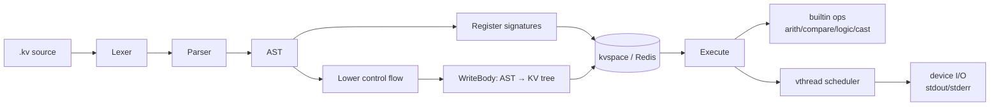

# kvlang

[](https://github.com/array2d/kvlang/actions/workflows/ci.yml)
[](https://github.com/array2d/kvlang/actions/workflows/ci.yml)
[](LICENSE)

**A declarative VM where code and data share the same key-value tree.**

Instructions are paths. Function calls are subtree copies. State is transparent and always inspectable — no hidden stack, no opaque heap.

> 中文文档: [README_CN.md](README_CN.md)

---

## Why kvlang?

Most VMs separate code from data. kvlang unifies them in a single KV tree:

```
/vthread/1/[0,0]  → "add"              # opcode
/vthread/1/[0,-1] → "/src/add/a"       # read operand
/vthread/1/[0,-2] → "/src/add/b"
/vthread/1/[0,1]  → "/src/add/c"       # write result
```

- **Instruction = path.** An opcode stored at `[i,0]`, operands as negative/positive indices.
- **Call = subtree copy.** Calling a function copies its body under the caller's frame.
- **State is a tree.** Every variable, every return value, every frame lives at a path you can `GET`.

Thread state is a KV tree you can inspect, migrate, or persist. No black box.

---

## Quick Start

```bash
# Prerequisites: Go 1.24+, Redis
make build

kvlang tutorial/01-hello/main.kv        # run a tutorial file
kvlang -c 'print("hello")'              # inline mode
kvlang --debug my_program.kv            # interactive single-step debugger
```

---

## Language Reference

### Write operator

```kv
expr           -> slot        // compute expr, write result to slot
func(a, b)     -> result      // call func, single return
func(a, b)     -> x, y        // call func, write two returns
func(a, b)     -> _, y        // discard first return, keep second
```

**Read-write code model — three rules:**
1. All function arguments must be **leaf nodes** (slot names or literals). No nested inline expressions.
2. One instruction per line.
3. Every write must be explicit via `->`.

```kv
// ✗ not allowed — nested expression as argument
print("result =", 10 - 3)

// ✓ correct — compute first, then pass slot
10 - 3 -> r
print("result =", r)
```

### Types

| Type     | Literals                     |
|----------|------------------------------|
| `int`    | `0`  `42`  `-7`              |
| `float`  | `3.14`  `0.5`  `1e9`        |
| `bool`   | `true`  `false`              |
| `string` | `"hello"`  `'world'`        |

### Operators

| Category   | Symbols                                  |
|------------|------------------------------------------|
| Arithmetic | `+`  `-`  `*`  `/`  `%`                 |
| Comparison | `==`  `!=`  `<`  `>`  `<=`  `>=`        |
| Logic      | `&&`  `\|\|`  `!`                        |
| Bitwise    | `&`  `\|`  `^`  `<<`  `>>`              |

> `/` always returns `float`. Use `int(a / b)` to truncate.

### Functions

```kv
// definition
def name(param: type, ...) -> (ret: type, ...) {
    // body: one instruction per line
}

// call — single return
name(arg1, arg2) -> slot

// call — multiple returns
name(arg1, arg2) -> a, b

// call — discard
name(arg1, arg2) -> _
```

### Control flow

```kv
if (cond) { ... }
if (cond) { ... } else { ... }

while (cond) { ... }          // loop until cond is false
while (cond) { ... break }    // early exit
while (cond) { ... continue } // skip to next iteration
```

`cond` must be a slot or a simple comparison (leaf-argument operands only).

### Built-in functions

| Function         | Description                    |
|------------------|--------------------------------|
| `abs(x)`         | absolute value                 |
| `neg(x)`         | negate (`-x`)                  |
| `sign(x)`        | −1 / 0 / +1                   |
| `pow(x, y)`      | power: xʸ                      |
| `sqrt(x)`        | square root                    |
| `exp(x)`         | eˣ                             |
| `log(x)`         | natural logarithm              |
| `min(a, b)`      | minimum                        |
| `max(a, b)`      | maximum                        |
| `int(x)`         | cast to int (truncate)         |
| `float(x)`       | cast to float                  |
| `bool(x)`        | cast to bool                   |
| `print(a, ...)`  | write to stdout                |
| `cerr(a, ...)`   | write to stderr                |
| `input(prompt)`  | read one line from stdin       |

### Entry point

All top-level instructions (outside any `def`) are wrapped into `init()`, the sole VM entry point.  
`main()` has no special status — call it explicitly at the top level:

```kv
def main() -> () { ... }
main() -> ()       // top-level call → executed as part of init
```

---

## Comprehensive Example

One file covering every language feature. Copy it, run it:

```kv
// kvlang-full.kv — every language feature in one file
// Run: kvlang kvlang-full.kv

// ─── Function definitions ────────────────────────────────────────────────

// Single return, if/else
def my_abs(x: int) -> (r: int) {
    if (x < 0) {
        -x -> r
    } else {
        x -> r
    }
}

// Multiple return values
def divmod(a: int, b: int) -> (q: int, r: int) {
    int(a / b) -> q
    a % b      -> r
}

// Tail-recursive factorial (TCO)
def fact(n: int, acc: int) -> (result: int) {
    if (n <= 0) {
        acc -> result
    } else {
        n - 1   -> n1
        acc * n -> acc1
        fact(n1, acc1) -> result
    }
}

// Tail-recursive fibonacci, multi-return (TCO)
def fib(n: int) -> (a: int, b: int) {
    if (n <= 1) {
        0 -> a
        1 -> b
    } else {
        n - 1 -> n1
        fib(n1) -> a, b
        a + b  -> x
        b      -> a
        x      -> b
    }
}

// ─── Main program ─────────────────────────────────────────────────────────
def main() -> () {

    // 1. Literals → slots
    42      -> n
    3.14    -> pi
    true    -> yes
    "hello" -> greeting
    -7      -> neg_n
    print(greeting)                          // hello

    // 2. Arithmetic
    n + 8  -> add_r                          // 50
    n - 2  -> sub_r                          // 40
    n * 2  -> mul_r                          // 84
    n / 5  -> div_r                          // 8.4  (/ always float)
    n % 5  -> mod_r                          // 2
    print("arith:", add_r, sub_r, mul_r, div_r, mod_r)

    // 3. Math builtins
    abs(neg_n)  -> abs_r                     // 7
    pow(2, 8)   -> pow_r                     // 256.0
    sqrt(pow_r) -> sqrt_r                    // 16.0
    min(3, 9)   -> min_r                     // 3
    max(3, 9)   -> max_r                     // 9
    sign(-5)    -> sgn_r                     // -1
    print("math:", abs_r, pow_r, sqrt_r, min_r, max_r, sgn_r)

    // 4. Comparison operators
    n == 42 -> eq_r                          // true
    n != 42 -> ne_r                          // false
    n >  40 -> gt_r                          // true
    n <  40 -> lt_r                          // false
    n >= 42 -> ge_r                          // true
    n <= 42 -> le_r                          // true
    print("cmp:", eq_r, ne_r, gt_r, lt_r, ge_r, le_r)

    // 5. Logic operators
    yes && lt_r -> and_r                     // false
    yes || lt_r -> or_r                      // true
    !yes        -> not_r                     // false
    print("logic:", and_r, or_r, not_r)

    // 6. Bitwise operators
    12 &  10 -> band_r                       // 8
    12 |  10 -> bor_r                        // 14
    12 ^  10 -> xor_r                        // 6
    1  << 4  -> shl_r                        // 16
    64 >> 2  -> shr_r                        // 16
    print("bits:", band_r, bor_r, xor_r, shl_r, shr_r)

    // 7. Type cast
    int(3.9)  -> i_r                         // 3
    float(7)  -> f_r                         // 7.0
    bool(0)   -> b_r                         // false
    print("cast:", i_r, f_r, b_r)

    // 8. if / else (via user function)
    my_abs(-5) -> a1
    my_abs(3)  -> a2
    print("my_abs:", a1, a2)                 // 5  3

    // 9. while loop
    0 -> total
    1 -> i
    while (i <= 10) {
        total + i -> total
        i + 1     -> i
    }
    print("sum(1..10) =", total)             // 55

    // 10. continue: sum of odd numbers 1..9
    0 -> odd_sum
    1 -> j
    while (j <= 9) {
        j % 2    -> rem
        rem == 0 -> even
        if (even) {
            j + 1 -> j
            continue
        }
        odd_sum + j -> odd_sum
        j + 1       -> j
    }
    print("odd sum(1..9) =", odd_sum)        // 25

    // 11. break: first even number > 4
    1  -> k
    -1 -> found
    while (k <= 100) {
        k % 2     -> rem2
        rem2 == 0 -> is_even
        k > 4     -> gt4
        is_even && gt4 -> hit
        if (hit) {
            k -> found
            break
        }
        k + 1 -> k
    }
    print("first even > 4:", found)          // 6

    // 12. Multiple return values
    divmod(17, 5) -> q, r
    print("17÷5 =", q, "rem", r)            // 3 rem 2

    // 13. Discard a return value with _
    divmod(17, 5) -> _, r_only
    print("17 mod 5 =", r_only)             // 2

    // 14. Recursion (TCO)
    fact(10, 1) -> f
    print("10! =", f)                       // 3628800

    fib(10) -> _, fib10
    print("fib(10) =", fib10)              // 55
}

main() -> ()
```

---

## Tutorial

Progressive examples — each file is self-contained and runnable:

| Step | Topic | Code |
|------|-------|------|
| [01](tutorial/01-hello/main.kv) | Hello World | `print("hello kvlang")` |
| [02](tutorial/02-vars/main.kv) | Variables | `42 -> x` |
| [03](tutorial/03-arith/main.kv) | Arithmetic | `+` `-` `*` `/` `%`  `pow` `sqrt` `abs` |
| [04](tutorial/04-func/main.kv) | Functions | `def add(A, B) -> (C)` |
| [05](tutorial/05-if/main.kv) | Conditionals | `if (x < 0) { … } else { … }` |
| [06](tutorial/06-while/main.kv) | While Loops | `while`, `break`, `continue` |
| [07](tutorial/07-recursion/main.kv) | Recursion | multi-return, TCO |
| [08-algo/](tutorial/08-algo/) | Algorithms | fibonacci, fizzbuzz, gcd, collatz, … |

```bash
kvlang tutorial/01-hello/main.kv         # run a step
kvlang tutorial/08-algo/fizzbuzz.kv      # run an algorithm
python3 run.py                           # integration test suite
python3 run.py --filter algo             # filter by keyword
```

---

## Architecture



**Pipeline**: `.kv` source → parse → lower control flow → write opcodes/operands as KV paths → Redis → workers execute by reading/writing those paths.

**Key components**:

| Layer | Package | Role |
|-------|---------|------|
| Parser | `internal/parser` | `.kv` → AST |
| Lower | `internal/lower` | if/while → block + branch |
| Layout | `internal/layoutcode` | AST → KV tree (opcode paths) |
| Scheduler | `internal/kvcpu` | goroutine workers, vthread dispatch |
| Storage | `internal/kvspace` | KVSpace interface (Redis impl) |
| Types | `internal/vtype` | int, float, bool, str, tensor |

---

## KV Path Reference

```
/vthread/<vtid>/<pc>/[i,0]      opcode
/vthread/<vtid>/<pc>/[i,-j]     read operand j
/vthread/<vtid>/<pc>/[i,+j]     write operand j
/vthread/<vtid>/<pc>/label/     control flow block
/src/<pkg>/<func>/              function body
/src/<pkg>/<func>/label/        block label sub-function
/func/main                      program entry signature
```

---

## Dependencies

**Only 2 direct dependencies:**

| Package | Purpose |
|---------|---------|
| `redis/go-redis/v9` | KV storage backend |
| `gorilla/websocket` | Optional WebSocket terminal |

Zero framework. Zero code generation. Pure Go standard library + Redis.

---

## License

MIT — see [LICENSE](LICENSE)
