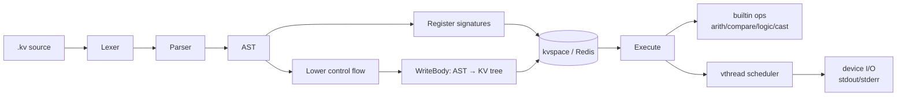

# kvlang

[](https://github.com/array2d/kvlang/actions/workflows/ci.yml)
[](https://github.com/array2d/kvlang/actions/workflows/ci.yml)
[](https://go.dev/)
[](LICENSE)
[](tutorial/)
[]()
[](CONTRIBUTING.md)

**A declarative VM interpreter where code and data share the same key-value tree.**

kvlang is not a toy. It's an agent-native, single-layer IR language with 87 tutorial examples, full CI coverage across Linux and macOS, and an architecture designed for distributed AI computation — all in ~5,000 lines of Go.

> 中文文档: [README_CN.md](README_CN.md) | Design: [kvlang-design](https://github.com/array2d/kvlang-design)

---

## Why kvlang?

Most VMs separate code from data. kvlang unifies them in a single KV tree:

```
/vthread/1/[0,0]  → "add"              # opcode
/vthread/1/[0,-1] → "/src/add/a"       # read operand
/vthread/1/[0,-2] → "/src/add/b"
/vthread/1/[0,1]  → "/src/add/c"       # write result
```

- **Instruction = path.** An opcode stored at `[i,0]`, operands as negative/positive indices.
- **Call = subtree copy.** Calling a function copies its body under the caller's frame.
- **State is a tree.** Every variable, every return value, every frame lives at a path you can `GET`.
- **Crash recovery.** Program counter is a KV path string. Restart the process, resume where you left off.
- **Agent-native.** Agent writes code, VM executes, Agent reads state — all via the same KV API.

Thread state is a KV tree you can inspect, migrate, or persist. No black box.

---

## Quick Start

```bash
# Prerequisites: Go 1.24+, Redis
make build

# Run tutorials
./kvlang tutorial/01-basics/hello.kv
./kvlang tutorial/03-control/if.kv
./kvlang tutorial/04-algo/fibonacci.kv

# Inline mode
./kvlang -c 'print("hello, world")'

# Pipe mode
echo '40 + 2 -> x  print(x)' | ./kvlang

# Syntax check
./kvlang vet my_program.kv

# Format source
./kvlang format my_program.kv
```

---

## Tutorial

87 self-contained examples. Start here:

```bash
./kvlang tutorial/01-basics/hello.kv         # hello kvlang
./kvlang tutorial/03-control/guess.kv        # binary search game
./kvlang tutorial/04-algo/fibonacci.kv       # fib = 55
./kvlang tutorial/05-leetcode/001_two_sum.kv # LeetCode
```

```
01-basics/        hello, vars, arith               (3 files)
02-func/          def, call, nested calls          (1 file)
03-control/       if, while, for, guess game       (5 files)
04-algo/          fibonacci, gcd, collatz, ...     (13 files)
05-leetcode/      73 LeetCode solutions            (65 files)
```

```bash
python3 tutorial/test.py                  # all 87 pass — verified by CI
```

---

## Language at a Glance

---

## Language at a Glance

### Read-Write Code

```kv
expr           -> slot        // compute expr, write result to slot
func(a, b)     -> result      // call func, single return
func(a, b)     -> x, y        // call func, write two returns
func(a, b)     -> _, y        // discard first return, keep second
```

**Three rules:**
1. All function arguments must be **leaf nodes** (slot names or literals). No nested inline expressions.
2. One instruction per line.
3. Every write must be explicit via `->`.

### Types

| Type     | Literals                     |
|----------|------------------------------|
| `int`    | `0`  `42`  `-7`              |
| `float`  | `3.14`  `0.5`  `1e9`        |
| `bool`   | `true`  `false`              |
| `string` | `"hello"`  `'world'`        |

### Operators

| Category   | Symbols                                  |
|------------|------------------------------------------|
| Arithmetic | `+`  `-`  `*`  `/`  `%`                 |
| Comparison | `==`  `!=`  `<`  `>`  `<=`  `>=`        |
| Logic      | `&&`  `\|\|`  `!`                        |
| Bitwise    | `&`  `\|`  `^`  `<<`  `>>`              |

> `/` always returns `float`. Use `int(a / b)` to truncate.

### Functions

```kv
def name(param: type, ...) -> (ret: type, ...) {
    // body: one instruction per line
}

name(arg1, arg2) -> slot          // single return
name(arg1, arg2) -> a, b          // multiple returns
name(arg1, arg2) -> _             // discard
```

### Control Flow

```kv
if (cond) { ... }
if (cond) { ... } else { ... }

while (cond) { ... }              // loop until cond is false
while (cond) { ... break }        // early exit
while (cond) { ... continue }     // skip to next iteration
```

`cond` must be a slot or a simple comparison.

### Built-in Functions

| Function         | Description                    |
|------------------|--------------------------------|
| `abs(x)`         | absolute value                 |
| `neg(x)`         | negate (`-x`)                  |
| `sign(x)`        | −1 / 0 / +1                   |
| `pow(x, y)`      | power: xʸ                      |
| `sqrt(x)`        | square root                    |
| `exp(x)`         | eˣ                             |
| `log(x)`         | natural logarithm              |
| `min(a, b)`      | minimum                        |
| `max(a, b)`      | maximum                        |
| `int(x)`         | cast to int (truncate)         |
| `float(x)`       | cast to float                  |
| `bool(x)`        | cast to bool                   |
| `print(a, ...)`  | write to stdout                |
| `cerr(a, ...)`   | write to stderr                |
| `input(prompt)`  | read one line from stdin       |

### Entry Point

All top-level instructions (outside any `def`) are wrapped into `init()`, the sole VM entry point.
`main()` has no special status — call it explicitly at the top level:

```kv
def main() -> () { ... }
main() -> ()       // top-level call → executed as part of init
```

---

## Comprehensive Example

One file covering **every language feature**. Copy it, run it:

```kv
// kvlang-full.kv — every language feature in one file
// Run: ./kvlang kvlang-full.kv

// ─── Function definitions ────────────────────────────────────────────────

def my_abs(x: int) -> (r: int) {
    if (x < 0) { -x -> r }
    else { x -> r }
}

def divmod(a: int, b: int) -> (q: int, r: int) {
    int(a / b) -> q
    a % b      -> r
}

// Tail-recursive factorial (TCO)
def fact(n: int, acc: int) -> (result: int) {
    if (n <= 0) { acc -> result }
    else {
        n - 1   -> n1
        acc * n -> acc1
        fact(n1, acc1) -> result
    }
}

// Tail-recursive fibonacci, multi-return (TCO)
def fib(n: int) -> (a: int, b: int) {
    if (n <= 1) { 0 -> a   1 -> b }
    else {
        n - 1 -> n1
        fib(n1) -> a, b
        a + b  -> x
        b      -> a
        x      -> b
    }
}

// ─── Main program ─────────────────────────────────────────────────────────
def main() -> () {
    // 1. Literals
    42      -> n
    3.14    -> pi
    true    -> yes
    "hello" -> greeting
    print(greeting)                          // hello

    // 2. Arithmetic
    n + 8  -> add_r                          // 50
    n - 2  -> sub_r                          // 40
    n * 2  -> mul_r                          // 84
    n / 5  -> div_r                          // 8.4
    print("arith:", add_r, sub_r, mul_r, div_r)

    // 3. Math builtins
    abs(-7)   -> abs_r                       // 7
    pow(2, 8) -> pow_r                       // 256.0
    sqrt(64)  -> sqrt_r                      // 8.0
    min(3, 9) -> min_r                       // 3
    max(3, 9) -> max_r                       // 9
    print("math:", abs_r, pow_r, sqrt_r, min_r, max_r)

    // 4. Comparison
    n == 42 -> eq_r                          // true
    n != 42 -> ne_r                          // false
    n >  40 -> gt_r                          // true
    n >= 42 -> ge_r                          // true
    print("cmp:", eq_r, ne_r, gt_r, ge_r)

    // 5. Logic
    yes && false -> and_r                    // false
    yes || false -> or_r                     // true
    !yes         -> not_r                    // false
    print("logic:", and_r, or_r, not_r)

    // 6. Bitwise
    12 & 10  -> band_r                       // 8
    12 | 10  -> bor_r                        // 14
    1  << 4  -> shl_r                        // 16
    print("bits:", band_r, bor_r, shl_r)

    // 7. Cast
    int(3.9)   -> i_r                        // 3
    float(7)   -> f_r                        // 7.0
    bool(0)    -> b_r                        // false
    print("cast:", i_r, f_r, b_r)

    // 8. User function
    my_abs(-5) -> a1
    my_abs(3)  -> a2
    print("my_abs:", a1, a2)                 // 5  3

    // 9. while loop — sum 1..10
    0 -> total
    1 -> i
    while (i <= 10) { total + i -> total   i + 1 -> i }
    print("sum(1..10) =", total)             // 55

    // 10. break — first even > 4
    1  -> k
    -1 -> found
    while (k <= 100) {
        k % 2      -> rem2
        rem2 == 0  -> is_even
        k > 4      -> gt4
        is_even && gt4 -> hit
        if (hit) { k -> found   break }
        k + 1 -> k
    }
    print("first even > 4:", found)          // 6

    // 11. Multiple returns
    divmod(17, 5) -> q, r
    print("17÷5 =", q, "rem", r)            // 3 rem 2

    // 12. Discard with _
    divmod(17, 5) -> _, r_only
    print("17 mod 5 =", r_only)             // 2

    // 13. Recursion (TCO)
    fact(10, 1) -> f
    print("10! =", f)                       // 3628800

    fib(10) -> _, fib10
    print("fib(10) =", fib10)              // 55
}

main() -> ()
```

---

## KV Path Reference

```
/vthread/<vtid>/<pc>/[i,0]      opcode
/vthread/<vtid>/<pc>/[i,-j]     read operand j
/vthread/<vtid>/<pc>/[i,+j]     write operand j
/vthread/<vtid>/<pc>/label/     control flow block
/src/<pkg>/<func>/              function body
/src/<pkg>/<func>/label/        block label sub-function
/func/main                      program entry signature
```

---

## Architecture



**Pipeline**: `.kv` source → parse → lower control flow → write opcodes/operands as KV paths → Redis → workers execute by reading/writing those paths.

**Key components**:

| Layer | Package | Role |
|-------|---------|------|
| Parser | `internal/parser` | `.kv` → AST |
| Lower | `internal/lower` | if/while → block + branch |
| Layout | `internal/layoutcode` | AST → KV tree (opcode paths) |
| Scheduler | `internal/kvcpu` | goroutine workers, vthread dispatch |
| Storage | `internal/kvspace` | KVSpace interface (Redis impl) |
| Types | `internal/vtype` | int, float, bool, str, tensor |

---

## Dependencies

**Only 2 direct dependencies:**

| Package | Purpose |
|---------|---------|
| `redis/go-redis/v9` | KV storage backend |
| `gorilla/websocket` | Optional WebSocket terminal |

Zero framework. Zero code generation. Pure Go standard library + Redis.

---

## License

MIT — see [LICENSE](LICENSE)
