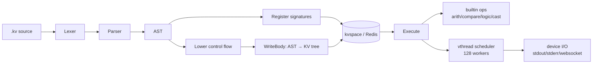

# kvlang

[](https://github.com/array2d/kvlang/actions/workflows/ci.yml)
[](LICENSE)

**A declarative VM where code and data share the same key-value tree.**

Instructions are paths. Function calls are subtree copies. State is transparent and always inspectable — no hidden stack, no opaque heap.

> 中文文档: [README_CN.md](README_CN.md)

---

## Why kvlang?

Most VMs separate code from data. kvlang unifies them in a single KV tree:

```
/vthread/1/[0,0]  → "add"           # opcode
/vthread/1/[0,-1] → "/src/add/a"    # read arg
/vthread/1/[0,-2] → "/src/add/b"
/vthread/1/[0,1]  → "/src/add/c"    # write result
```

- **Instruction = path**. An opcode stored at `[i,0]`, operands as negative/positive indices.
- **Call = subtree copy**. Calling a function copies its body under the caller's frame.
- **State is a tree**. Every variable, every return value, every frame lives at a path you can `GET`.

This means you can `GET /vthread/1/[5,-1]` to see a variable mid-execution. Thread state is a KV tree you can inspect, migrate, or persist. No black box.

---

## Quick Start

```bash
# Prerequisites: Go 1.24+, Redis (any version)
make build                    # build kvlang binary

# Run a file
echo 'print("hello kvlang")' > hello.kv
kvlang hello.kv               # → hello kvlang

# Inline mode
kvlang -c '1 + 2 + 3 -> "./x"; print("x =", "./x")'   # → x = 6

# Serve mode (daemon with Redis persistence)
kvlang load my_program.kv
kvlang serve                  # workers execute, output to stdout
```

---

## Architecture



**Pipeline**: `.kv` source → parse → lower control flow → write opcodes/operands as KV paths → Redis → workers execute by reading/writing those paths.

**Key components**:

| Layer | Package | Role |
|-------|---------|------|
| Parser | `internal/parser` | `.kv` → AST |
| Lower | `internal/lower` | if/while → block + branch |
| Layout | `internal/layoutcode` | AST → KV tree (opcode paths) |
| Scheduler | `internal/kvcpu` | 128 goroutine workers, vthread dispatch |
| Storage | `internal/kvspace` | KVSpace interface (Redis impl) |
| Types | `internal/vtype` | int, float, bool, str, tensor |

---

## Language at a Glance

```kvlang
// Activate stdout
str.set("kvlangrun") -> './term'

// Define a function
def add(A: int, B: int) -> (C: int) {
    A + B -> './C'
}

// Call it
add(10, 32) -> './sum'
print("sum =", './sum')    // → sum = 42
```

### Control Flow

```kvlang
def abs(x: int) -> (r: int) {
    if (x < 0) {
        -x -> './r'
    } else {
        x -> './r'
    }
}
```

### Multi-return & Recursion (TCO)

```kvlang
def fib(n: int) -> (a: int, b: int) {
    if (n <= 1) {
        0 -> './a'
        1 -> './b'
    } else {
        fib(n - 1) -> './a', './b'
        './a' + './b' -> './x'
        './b' -> './a'
        './x' -> './b'
    }
}
fib(10) -> './_', './result'
print("fib =", './result')    // → fib = 55
```

---

## Tutorial

Progressive examples — each file is self-contained and runnable:

| Step | Topic | Code |
|------|-------|------|
| [01](tutorial/01-hello/main.kv) | Hello World | `print("hello kvlang")` |
| [02](tutorial/02-vars/main.kv) | Variables | `42 -> ./x` |
| [03](tutorial/03-arith/main.kv) | Arithmetic | `10 + 3`, `pow(2,5)`, `sqrt(144)` |
| [04](tutorial/04-func/main.kv) | Functions | `def add(A,B)->(C)` |
| [05](tutorial/05-if/main.kv) | Conditionals | `if (x < 0) { … }` |
| [06](tutorial/06-while/main.kv) | While Loops | `while`, `break`, `continue` |
| [07](tutorial/07-recursion/main.kv) | Recursion | multi-write params, TCO |
| [08-algo/](tutorial/08-algo/) | Algorithms | fibonacci, fizzbuzz, gcd, collatz, … |

```bash
kvlang tutorial/01-hello/main.kv        # run a step
kvlang tutorial/08-algo/fizzbuzz.kv     # run an algorithm
python3 run.py                          # integration test suite (~50 tests)
python3 run.py --filter algo            # filter by keyword
```

---

## Dependencies

**Only 2 direct dependencies:**

| Package | Purpose |
|---------|---------|
| `redis/go-redis/v9` | KV storage backend |
| `gorilla/websocket` | Optional WebSocket terminal |

Zero framework. Zero code generation. Pure Go standard library + Redis.

---

## KV Path Reference

```
/vthread/<vtid>/<pc>/[i,0]      opcode
/vthread/<vtid>/<pc>/[i,-j]     read operand j
/vthread/<vtid>/<pc>/[i,+j]     write operand j
/vthread/<vtid>/<pc>/label/     control flow block
/src/<pkg>/<func>/              function body
/src/<pkg>/<func>/label/        block label sub-function
/func/main                      program entry signature
```

---

## License

MIT — see [LICENSE](LICENSE)
