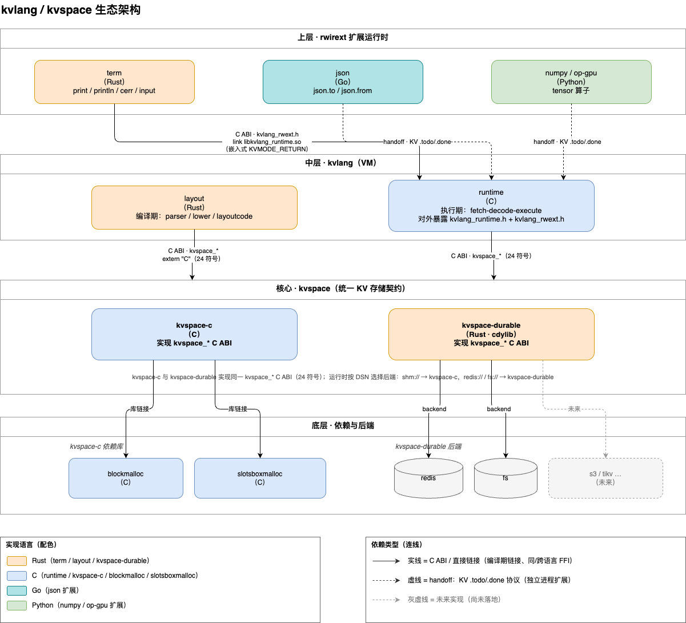

# kvlang

[](https://github.com/array2d/kvlang/actions/workflows/ci.yml)
[](LICENSE)
[](tutorial/)
[](stdlib/kvlang/spec/)

**以 kvspace 为寻址空间和内存空间、小核心、扩展主导的明文解释执行语言（原训推框架 deepx 的前端语言，前身 dxlang）。** 代码与数据统一在一棵 KV 树；PC 即 KV 路径、可崩溃恢复，源码即 IR、KV 皆明文。核心 runtime 只做执行循环与控制流，其余能力由其它 runtime 提供、注册在 `/lib/<opcode>`。

> English: [README.md](README.md)
>
> **规范是唯一事实源。** 语言事实在 [`stdlib/kvlang/spec/`](stdlib/kvlang/spec/)——84 章规范性条文加唯一权威文法，以 kvlang 自身书写、layout 落进 `/lib/kvlang/spec/…`。语言行为的任何改动一律规范驱动：先改规范条款及其锚定示例，再改实现，直至锚定 tutorial 在所有后端通过。规范与实现不符时以规范为准，实现视为缺陷。本 README 为教学衍生。

---

## 应用场景

- **deepx 的模型前端**：作为训推一体化框架 deepx 的前端语言（前身 dxlang），以 KV 树表达模型结构与算子图——代码、参数、中间结果同在一棵 KV 树，按路径寻址。
- **自迭代 agent（如 byteseek）**：agent harness 用 kvlang 编写；代码即数据、PC 即路径、崩溃可按 PC 恢复，agent 读改自身代码与状态走同一套 KV 读写。

---

## 核心模型：一屏看懂

**不分 IR 层，源码即 IR。** 程序计数器是 kvspace 路径字符串，调用栈深度是路径里的帧号：

```
PC   = "/vthread/<vid>/[1]/[3,0]"          vthread vid、第 1 帧、第 3 条指令
取指 = GetBatch(帧目录/, ["[3,0]"])         从帧目录取 opcode（extindex → /lib）
调用 = 创建 [d+1] 帧；返回 = DelTree        崩溃后按 PC 重启继续
goto/br = 只改同一帧的 irseq                if/while 不建帧
```

每条指令占据二维坐标 `[s0, s1]`：`s0=0` 是签名行，`s0≥1` 是指令（即 **irseq**）；沿 `s1` 轴，`[s0,0]` 恒为操作码，`[s0,-j]` 读参，`[s0,+j]` 写参。

代码三级——`lib`（包）/ `rwfunc`（函数）/ `rwir`（原子指令）——每级与 KV 树的层次对齐。`if` / `while` / `for` 不是第四级：由 layout lower 成 `goto`/`br`。

```kv
lib main {
    rwfunc add(a:int64, b:int64) -> (c:int64) { a + b -> c }
}
```

```
/lib/main·add/[0,0]  = "+"     /lib/main·add/[0,-1] = "a"
/lib/main·add/[0,-2] = "b"     /lib/main·add/[0,1]  = "c"
```

三个地址空间域有固定的结构语义：`/lib`（函数库——签名、指令树、`def rwir` 路由头）、`/vthread`（运行时栈帧）、`/networld`（外部世界登记域）。`/` 下其余路径全部由用户自定义，无核心约定。**没有 `/dev` 设备域，也没有终端**——KV 世界里只有 key 和 value；`print` 这类 I/O 不是核心语言原语。

键形态三分，三类零交集：`X/名`（结构——帧、指令槽、目录；核心所有）、`X·名`（用户数据成员）、`X/‥名`（系统变量——影子元数据；核心所有）。

---

## 生态架构

kvspace 是核心的寻址空间与内存空间；语言本体是小核心 runtime，能力由上层扩展承担。



- **kvspace** — 一套 PascalCase、无下划线的 C ABI（`kvspaceGet`、`kvspaceWriteInPlace`、`kvlangRuntimeConnect`）；两种实现由运行期 DSN 选择：`kvspace-c`（C，`shm://`）与 `kvspace-durable`（Rust，`redis://` / `fs://`；s3 规划中）。各后端必须逐字节一致。
- **layout** — Rust crate（`bin/libkvlanglayout.so`，CLI `bin/kvlanglayout`）。**o0 编译器**：scan → parse → lower（控制流降级、类型推断、特化）→ 把 KV 指令树写进 `/lib`。它**不做任何优化**——在此优化会丢掉其它 runtime 赖以在异构硬件上优化所需的高层语义。只写 `/lib`，诊断三级：`error` / `warn` / `info`。
- **runtime-c** — 核心解释器（`bin/libkvlang_runtime.so`，C11）。纯解释：取指-译码-执行、native rwir 派发、拷贝操作码 `=`、call/return/br/goto、用户函数调用。不编译、不优化、不重排。只依赖 `kvspace*` C ABI。
- **runtime-rs** — Rust（`bin/kvlang`，即 `kvlang` CLI）。一个参考 **myrwir 宿主**：链接 layout 与 runtime-c，解释自己的操作码、路由其余。其进程内 families：`term`、`json`、`http`、`networld`、`kvlang·*`。
- **三个阶段** — layout（o0）→ 编译器（一种扩展）→ runtime（纯解释）。编译器不属语言核心；规范卷 06 只界定它与核心的契约（前端算子/后端算子、后端绑定、算子版本化）。未编译的 `/lib` 可直接运行。

### myrwircaps：一个操作码如何被兑现

每个 runtime 声明 **`myrwircaps`**——它能就地解释的操作码表（`opcode → handler`）。派发是固定的整数跳转表：在 `myrwircaps` 内的操作码本地兑现；控制类操作码、拷贝操作码、用户函数调用由核心处理；其余走 `notinmyrwircaps`——runtime 查 `/lib/<opcode>`，那里由 **`def rwir` 路由头**登记该 op，再交给 `myrwircaps` 含它的 runtime。`def rwir` 只存在于 `/lib/<op>`：绝不在 kv 源码中声明、也绝不由 layout 产生。`rwfunc` 自带可解释的实现体，故无需路由头——所以有 `def rwir` 而无 `def rwfunc`。

跨进程 handoff 走队列 `/lib/<opcode>/vids/<vtid> = pc`：调用方 runtime `kvspace·watch` 到该项消失为止；进程内操作码在驱动循环里直接派发，无 handoff。

---

## Quick Start

依赖：C 工具链 + cmake、Rust（cargo），以及装到 `/usr/lib/kvspace` 的 kvspace ABI 库（由 [`ci/deps.sh`](ci/deps.sh) 按 [`deps.json`](deps.json) 里的 tag 拉取）。Go 仅 Go `json` 示例扩展需要。

```bash
git clone git@github.com:array2d/kvlang.git
cd kvlang
make all                                     # runtime(C) + layout(Rust) + runtime-rs(Rust) + json(Go)

./bin/kvlang tutorial/01-basics/hello.kv     # 运行文件（入口 rwfunc test）
./bin/kvlang -c 'println("hello, world")'    # inline 模式（入口 init）
./bin/kvlang vet my.kv                       # 只 parse + lower
./bin/kvlang format my.kv                    # 格式化到 stdout
./bin/kvlang layout my.kv                    # 打印入口点
./bin/kvlang dump my.kv                      # 把 /lib 逆向重建为可运行 kvlang
```

`make` 目标：`all` · `runtime` · `layout` · `runtime-rs` · `json` · `oldhero` · `test` · `install` · `clean`。`make install` 把库装到 `/usr/lib`、CLI（`kvlang`、`kvlanglayout`）装到 `/usr/bin`、头文件装到 `/usr/include/kvlang`。

**后端**由 `KVSPACE` DSN 选择（默认 `redis://127.0.0.1:6379`）：

```bash
KVSPACE=shm:///tmp/kvlang.shm ./bin/kvlang tutorial/01-basics/hello.kv   # kvspace-c
KVSPACE=fs:///tmp/kvlang-fs   ./bin/kvlang tutorial/01-basics/hello.kv   # kvspace-durable
```

另有两种模式：`kvlang create <func>` 打印 vthread `vid`，`kvlang run <vid>` 从持久化的 PC 继续（崩溃恢复）。无参数且设了 `KVLANG_LIB=p1:p2:…` 时，kvlang 会 layout 这些路径下的所有 `.kv` 并运行各 lib 的 `init`。

---

## Language Guide

### 十条铁律（先读这条）

1. 乘用 `×`、除用 `÷`。`*` 不是乘（是指针/解引用运算符）。`/` 不是除（是路径分隔符与注释标记）。
2. 没有 `int` / `float` / `char` 简写，也没有 `object`。数值写定宽（`int64`、`float64` 等）；字符串是 `[]char/<编码>`；异构记录用 `{k=v}` 字面量或 `struct`。
3. 赋值两个方向：`表达式 -> 槽`（写槽在右）、`槽 = 表达式`（写槽在左）。`=` 不是表达式——判断相等用 `==`。没有 `<-`。
4. 每条指令一行最清晰；`;` 与换行等价（`a = 1; b = 2` 合法）。
5. 注释是 `//` 行注释、`/* */` 块注释（块注释可嵌套）。没有 `#` 注释。
6. 字符串只有 `"…"`（转义）和 `r"…"` / `r#"…"#`（原始）。没有 `"""` 三引号、没有反引号。
7. 写参会拷入调用方当前位置的当前值，该位置未赋值时初值为 `None`——故累加前必须先置初值：`0 -> acc`，否则 `None + x` 报错。
8. 数组要带 `[]` 前缀：`a:[]int64 = [1, 2, 3]`。空容器必须标类型：`d:[]char/utf32·int64 = {}`。
9. `+` 只允许同类：字符+字符=拼接，数值+数值=相加；`"标签" + 数字` 会 TypeError。带标签打印用多参数：`println("answer =", n)`（自动空格）。
10. 函数没有返回值，结果通过写参传出：`rwfunc f(x:int64) -> (r:int64) { x + 1 -> r }`，调用 `f(3) -> y`。

### 程序结构

一个文件由 `lib` 块、`rwfunc` 声明与指令构成。**没有 `import`**——`/lib` 树本身就是全局命名空间，跨库调用写全路径或限定名 `pkg·func`。每个参数都必须带类型标注。

```kv
rwfunc test() -> () {
    total = 0
    1 -> i
    while (i <= 5) {
        total + i -> total
        i + 1 -> i
    }
    println(total)          // 15
}

test()
```

入口约定：文件为 `rwfunc test()`，inline 源码为 `init`；lib 层的裸指令会被合并进隐式的 `init`。`if` / `while` / `for` 只能出现在 `rwfunc` 体内。

### 写入两形态（`=` 与 `->`）

```kv
x = 40 + 2                  // = ：写槽在左
x × y -> z                  // -> ：写槽在右
f(a, b) -> r                // 函数写参映射；多写参 -> x, y；丢弃用 -> _
```

`=` 只是"写左"的源码别名；落进 kvspace 的**永远**是 `->` 轴结构——读参在负轴、写参在正轴。写槽必须是**位置**：裸名（帧内变量）、`/abs/path`（全局键）或 `base·成员`。字面量不是位置。

**读参只读**——经成员/下标写、`kvspace·set(base, …)` 写、以及别名（`q = p` 后写 `q`）都不豁免。写参可读可写。要在函数内修改数组或 map，须把它声明为写参：`a[i] = v` 写穿 `a`。

### 类型

定宽数值：`int8 int16 int32 int64 uint8 uint16 uint32 uint64 float32 float64`。用于 tensor 标注的低精度种类（runtime 只搬字节，不对其做算术）：`float16` `bfloat16` `float8/e4m3` `float8/e5m2`。其它：`bool`、`char/utf8` `char/utf32` `char/ascii`、`stringkeymap`、`index`、`struct`、`time`、`duration`、`any`。

```kv
float64(3) -> f          // 3.0
int64(3.9) -> i          // 3（向零截断）
int64("42") -> n         // 42
bool(1) -> b             // true
char/utf32(x) -> s       // 字符串编码转换（如 char/utf8 → char/utf32）
```

十个数值算子既是构造函数也是类型转换。算术保宽（同宽运算保持同宽、溢出回绕）；混宽提升到更宽（`int32 + int64 → int64`），混入浮点走浮点。`index` 与 `extindex` 是 **storetype**、不是 kind；`p`（ptr）与 `None` 也不是 kind。

`string·formatint(n, base)` / `string·formatuint(n, base)` 整数按进制转字符串；`string·parseint(s, base)` / `string·parseuint(s, base)` 字符串转整数（base 2..36）。

### langtype：两型

**langtype** 是一个值的真实类型：单一具体 kind 加确定的 `[dims]`，不含并集与轴量词。**def langtype** 是定义处的匹配类型（`def rwir` 签名行、或 `rwfunc` 参数定义），可含并集 `A|B`、轴量词 `.` `?` `*` `+`、`any` 与 mapexpr——一条 def langtype 可匹配许多 langtype。两型共用同一套文法（附录文法为唯一权威）；强调"一条具体类型表达式串"时统称 **kindexpr**。

### 数组（compact `[…]`）

```kv
a:[]int64 = [7, 2, 9, 4]
ndarray·numel(a) -> n     // 4（元素数）
ndarray·dim(a) -> d       // 1（维数）
ndarray·shape(a) -> sh    // 各轴长度
xv·at(a, 2) -> e          // 9（越界报错）
xv·set(a, 1, 99) -> b     // 新数组 [7, 99, 9, 4]
a[0] -> head              // 7
xv·langtype(a) -> lt      // "[4]int64"
xv·bodylen(a) -> bl       // 32（body 字节数）
```

数组有两种物理形态，**由字面量括号决定**：`[1,2,3]` 是 **compact**（定长同型元素连续打包进单个 XValue；`[N]T` / `[d0,d1]T`），`{v0,v1,…}` 是 **stringkeymap** 形态（每元素独立子 key、可增长；变长字符串落这里，不落 `[…]`）。多维 `[2,3]int64` 也是 compact ndarray。定长初始化写 `a:[1024]int32 = []`（全零）。互转是 `array·scatter`（compact → stringkeymap）与 `array·compact`（反向）。

遍历 compact 数组用 `while` + `ndarray·numel` + `xv·at`。字符串数组或变长集合用 `{}` 形态。

### map、成员访问与 struct

容器成员一律用 `·`（U+00B7）访问，**绝不用 `[]`**——`[]` 只索引 compact 数组。访问键**逐字即键侧 formatter 的输出**；kvspace 与 runtime 均不得改写、归一化或自动加壳。裸标量键与 1 元元组键是不同 formatter，永不互转：`b:int64·int64 = {}` 的访问键是 `b·200`，不是 `b·[200]`。数组形状（`[N]T`）根本不能作键。

```kv
d:[]char/utf32·int64 = {}     // 空 stringkeymap 必须标类型
d·a = 10                      // 静态成员写
kvspace·get(d, "a") -> x      // 动态读（缺失返回 None）
k = "a"
d·*k -> v                     // 动态成员读：k 的值作键
kvspace·set(d, "c", 30) -> _  // 动态成员写

m = map()                     // 构造空 stringkeymap

r = {name="kv", ver=1}        // struct 字面量（异构记录；没有 object）
r·name -> n                   // 成员读
5 -> r·ver                    // struct 成员可写
```

map 的声明形式是 `memheadname : memitemkey_formatter · memitemvalue = {}`——键侧是**格式器**（key 只活在路径系统里、从不进入 XValue body），三选一：裸标量、字符串键 `[]char/<编码>`、标量元组 `[scalar,…]`。值侧递归，故 map 可嵌套。

具名 struct（需字段默认值或复用类型时）：

```kv
struct Point { x:int64=0 y:int64=0 }
rwfunc test() -> () {
    p:Point = {x=3 y=4}
    println(p·x, p·y)         // 3 4
}
```

`struct Name { field:type=default }` 在 `/lib/Name` 注册一个原型；实例化 `Name{f=v}` 克隆原型、覆盖给定字段并做类型校验。struct 不是平行的类型注册表——原型本身就是 KV 数据。

跨函数共享的数据放**绝对路径**（帧内变量随帧返回销毁）：`/n1·val = 1`。

### 指针

`&x` 是**绝对地址**运算符（`&x ≡ kvlang·abs(x)`）：产生一个指针，即 `ref=1` 的值，其 head 的 storetype/langtype 描述目标的完整形态、body 是目标 key 路径。`*p` 解引用；`p·字段` 自动解引用取成员。赋值时只做**单跳**类型检查——指针声明的目标 langtype 对所指 key 的实际 langtype，不递归展开链。值容器（map langtype 或 struct 原型路径）没有 body 可拷贝，必须以 `*T` 传递。**空指针就是 `None`**——没有 `""` 哨兵，`p == ""` 非法；判空写 `p != None`。普通字符串变量不是指针。

指针作 map 键必须写前导 `*`（`base·*k`）；省略非法，因为不会自动解引用。这是**显式**解引用，不是自动改键。

### 控制流（仅限 rwfunc 体内）

```kv
if (c) { … } else if (c2) { … } else { … }
while (c) { … }
for (e in arr) { … }        // 遍历 compact 数组
break / continue
return                      // 无返回值
```

map 遍历用 `while` + `kvspace·listlen` + `kvspace·listn`（`for`-`in` 对 map 不可靠）——注意目录路径要带尾 `/`。控制流只是源码语法；layout 把它展平成线性 irseq，再 lower 成 `goto` / `br`。

### 操作符

| 类别 | 符号 |
|------|------|
| 算术 | `+` `-` `×` `÷` `%` |
| 一元前缀 | `-` `!` `√`（sqrt） `&`（绝对地址） `*`（解引用） |
| 比较 | `==` `!=` `<` `>` `<=` `>=`（及 `≠` `≤` `≥`） |
| 逻辑 / 位运算 | `&&` `\|\|` `!` 及 `&` `\|` `^` `<<` `>>` |

> `÷`：两侧均 int → 整除（`7÷2`=3）；任一侧 float → 浮除（`7.0÷2`=3.5）。
> `/` 保留用于路径与注释；`*` 是指针/解引用运算符，不是乘。

### 内建函数

**内建**是核心 runtime `myrwircaps` 里的 rwir：纯 KV→KV 计算，不做 I/O。

**算术 / 比较 / 逻辑 / 位：** `add`(`+`) `sub`(`-`) `mul`(`×`) `div`(`÷`) `mod`(`%`) `pow` `sqrt`(`√`) `exp` `log` `neg` `abs` `sign` `min` `max`；`eq` `neq` `lt` `gt` `le` `ge` `and` `or` `not` `bitand` `bitor` `bitxor` `shl` `shr`
**类型构造：** `bool` `int8` … `int64` `uint8` … `uint64` `float32` `float64` `char/utf32` `char/utf8` `char/ascii`；容器构造 `map` `array` `struct·new`
**`array·`：** `scatter` `compact` `append` `slice` `fill`  ·  **`ndarray·`：** `numel` `dim` `shape`
**`xv·`：** `at` `set` `reshape` `reinterpret` `langtype` `bodylen`
**`string·`：** `len` `char` `ord` `cmp` `find` `slice` `concat` `set` `formatint` `formatuint` `parseint` `parseuint`
**`kvspace·`：** `get` `set` `del` `deltree` `cp` `cpdir` `cplist` `list` `listlen` `listn` `mkindex` `extindex` `rmindexext` `watch`
**`time·` / `time/duration·` / `random·`：** `now` `sub` `add` `before` `after`；`nanos` `millis` `seconds` `minutes` `hours` 及各 `as_*` 形式；`uint64` `int63` `intn`
**`vthread·` / 调试：** `create` `run` `call` `sleep` `setstatus`；`debugger`（≡ `vthread·setstatus("paused")`）

`print` / `println` / `cerr` / `printf` / `input` **不是**内建。KV 世界里没有终端，只有 key 和 value——I/O 不是核心语言原语。它们是 `term` runtime 的操作码，经上文所述的 `def rwir` 路由头机制到达。同一机制覆盖 `json·to` / `json·from`、`http·call` / `http·get|post|put|del`、`networld/proc·exec`、`networld/fs·size|read|write|append|list|del|mkdir|exists`，以及自举的 `kvlang·vet|format|layout|dump`。

```kv
print(x,…)              // 无空格、无换行
println(x,…)            // 空格分隔、换行
cerr(x,…)               // 同 println，写 stderr
printf(fmt,…)           // C 风格：%d %i %u %o %x %X %f %e %g %c %s %%；不换行
input(prompt) -> line   // 读一行 stdin
```

字符串↔字节走 `xv·reinterpret`。一小层 kvlang 级 stdlib 把常见模式包成 rwfunc：[`stdlib/`](stdlib/) 下的 `kvspace`（`has`、`get_or`、`set_default`）、`string`、`math`、`time`、`time/duration`、`xv`、`http`。

### 完整示例

```kv
rwfunc test() -> () {
    s = "hello"
    string·len(s) -> n
    println(n)                  // 5

    a:[]int64 = [1,2,3,4]
    0 -> acc
    0 -> i
    while (i < ndarray·numel(a)) {
        xv·at(a, i) -> e
        acc + e -> acc
        i + 1 -> i
    }
    println(acc)                // 10

    d:[]char/utf32·int64 = {}
    d·a = 10
    kvspace·get(d, "a") -> x
    println(x)                  // 10
}
```

面向 LLM 的一页语法速览见 [`stdlib/kvlang/kvlangbrief.kv`](stdlib/kvlang/kvlangbrief.kv)。

---

## Tutorial

210 个自包含示例（其中 202 个用 `// 期望输出` 头给出期望输出），按主题组织：

```
01-basics/      hello, arith, precision, numtypes, strings, …     (18)
02-func/        rwfunc, call, accumulator                         (4)
03-control/     if, while, for, guess                             (5)
04-ndarray/     compact 数组、下标、多维                           (12)
05-dict/        map、动态键、缺失键 → None                         (3)
06-algo/        gcd, collatz, power, factorial, …                 (8)
07-lib/         lib 块、嵌套、跨库、匿名                            (13)
08-leetcode/    LeetCode 题解                                     (88)
09-debugger/    debugger 内建                                     (3)
10-types/       带类型 map、嵌套类型、元组键                        (8)
11-string/      字符串操作                                        (9)
12-struct/      struct 声明、字段、指针、链表                       (10)
13-stdlib/      stdlib：time、duration、kv、xv、math、string       (15)
14-networld/    进程 exec、文件系统、http                          (10)
15-vthread/     vthread create/call/run                           (4)
```

```bash
./bin/kvlang tutorial/01-basics/hello.kv          # 运行一个示例
./bin/kvlang tutorial/06-algo/gcd.kv              # gcd = 6

python3 tutorial/test.py                          # 全套 — 即一致性测试
python3 error_cases/error_test.py                 # 期望诊断用例
```

`tutorial/test.py` 发现 `tutorial/` 下所有 `.kv`，提取 `// 期望输出` 期望，用 `bin/kvlanglayout` layout 后运行，再比对 stdout。tutorial 套件**就是**一致性测试：每条锚定示例的输出在所有后端逐字节一致，即为符合。`error_cases/` 有 37 个用例、覆盖 10 个诊断类别。

---

## Benchmark

`benchmark/` 是跨语言、跨后端性能基准。每个 case 是同一算法的 kvlang / Python / Rust / C
等价实现；kvlang 分别在三个 kvspace 后端（`shm` / `fs` / `redis`）上各跑一列，原生/脚本版本作基线。
规模固定以保证长期可比，每次运行只追加到带版本号的 CSV——按同机同 case、以 version
排序即得性能演进曲线。

十个 case：`binary_search`、`binary_trees`、`fib`、`hash_table`、`iops`、`k_nucleotide`、`matmul`、`nqueens`、`prime_sieve`、`quicksort`。

```bash
python3 benchmark/run.py            # 全部 case × 三后端，追加带版本号 CSV
python3 benchmark/run.py --show     # 打印历史记录
```

case、计时约定、CSV 字段见 [benchmark/README.md](benchmark/README.md)。

---

## 规范

语言的规范性定义在 [`stdlib/kvlang/spec/`](stdlib/kvlang/spec/)，以 kvlang 书写、layout 落进 `/lib/kvlang/spec/…`。它是唯一事实源；本 README 为衍生。

| 卷 | 内容 |
|----|------|
| [00-导言](stdlib/kvlang/spec/00-导言/) | 范围、规范用语、阅读约定 |
| [01-词法](stdlib/kvlang/spec/01-词法/) | 源码结构、词法单元、注释、标识符、路径字面量、字面量、运算符与优先级 |
| [02-kvspace模型](stdlib/kvlang/spec/02-kvspace模型/) | 地址空间、结构域、寻址与命名、C ABI、XValue head 线格式、数组两种形态、指令布局、vthread、系统变量 |
| [03-类型系统](stdlib/kvlang/spec/03-类型系统/) | 种类与定宽类型、langtype、map 容器、成员访问、ptr、struct、head 三正交维、wire 布局、字符串编码 |
| [04-layout语义](stdlib/kvlang/spec/04-layout语义/) | 指令架构、指令槽编码、函数与写槽、控制流及其降级、layout 流水线与 ABI、诊断 |
| [05-runtime语义](stdlib/kvlang/spec/05-runtime语义/) | 执行模型、成员访问、函数调用、runtime-c 内建、runtime 开发规范、notinmyrwircaps、C ABI |
| [06-编译器语义](stdlib/kvlang/spec/06-编译器语义/) | 核心与扩展编译器的契约：前端算子/后端算子、后端绑定、算子版本化 |
| [附录](stdlib/kvlang/spec/附录/) | 唯一权威文法：程序结构、类型表达式、指令、表达式、控制流、内建函数 |
| [设计理由](stdlib/kvlang/spec/设计理由/) | 非规范动机说明：存算分离、一切皆明文、程序即数据结构、代码层级、如何设计一门语言 |

stdlib 与 spec 的渲染视图发布在 [array2d.github.io/kvlang](https://array2d.github.io/kvlang/)。

---

## License

MIT — see [LICENSE](LICENSE)
